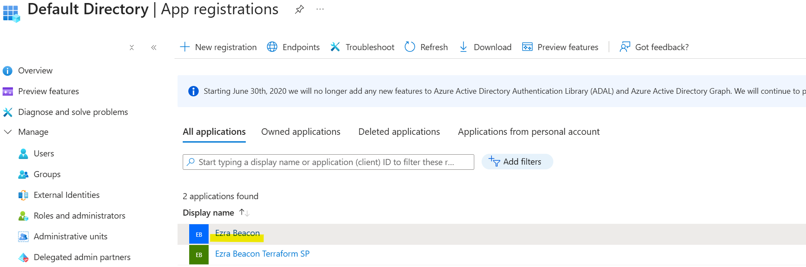
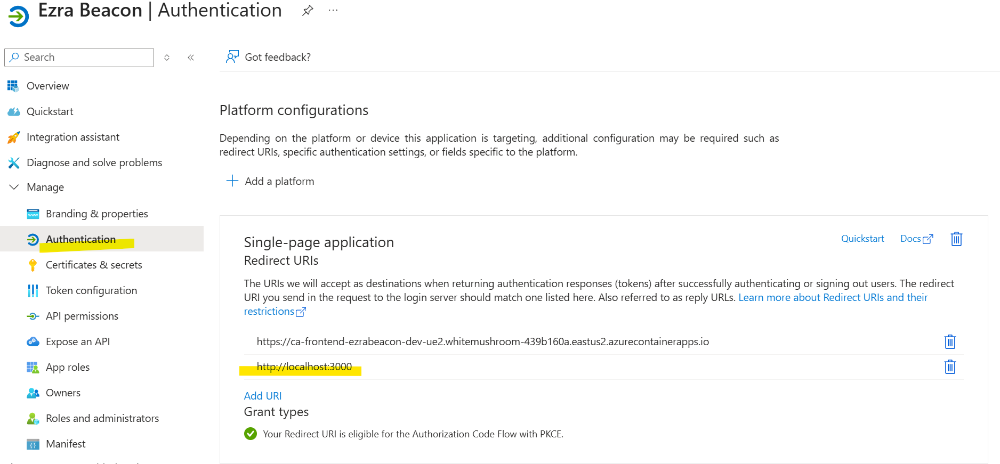
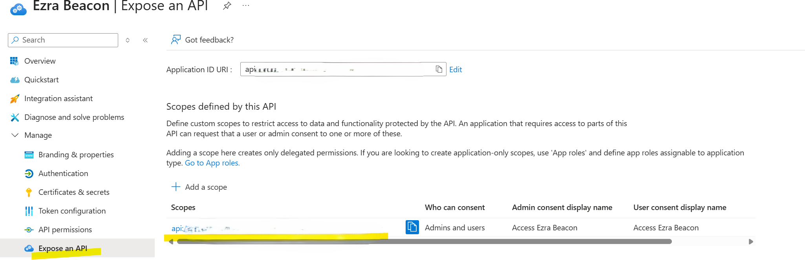
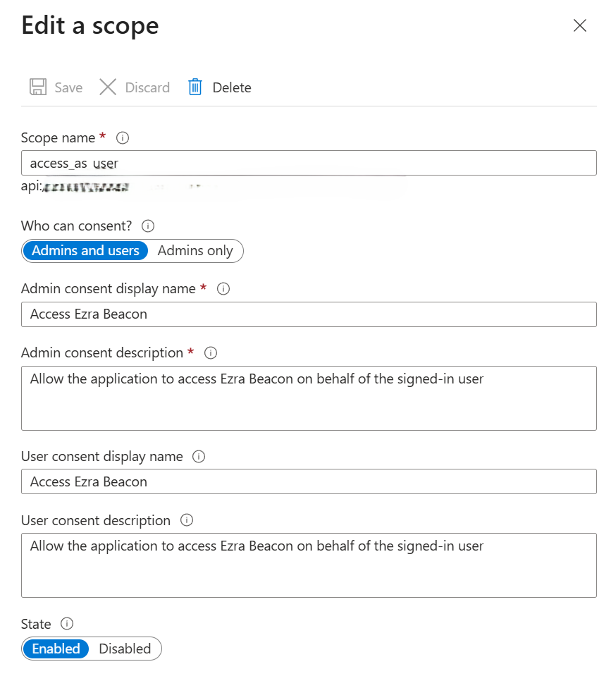
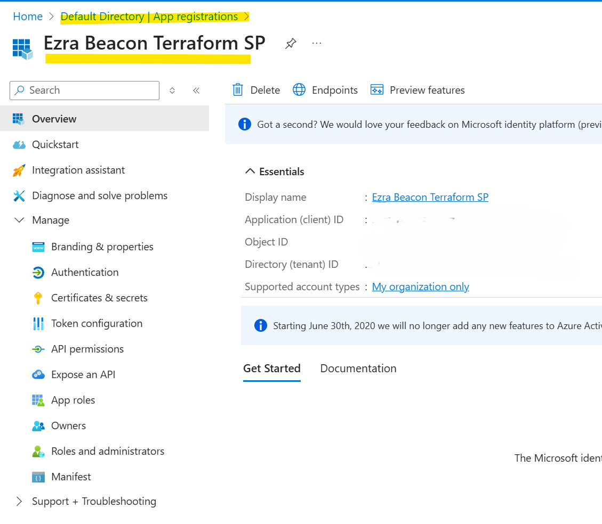
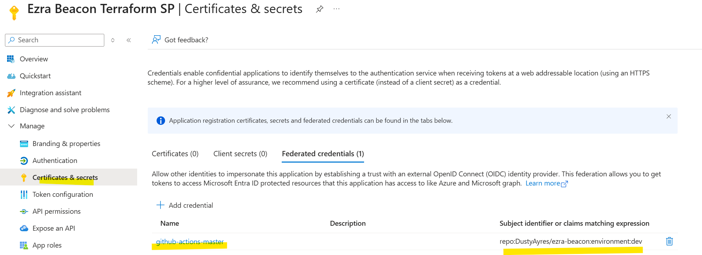
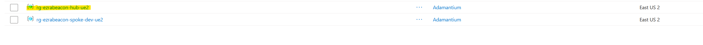
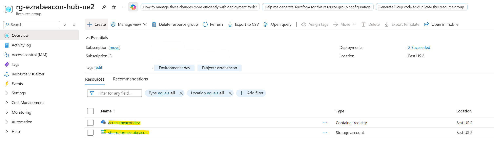
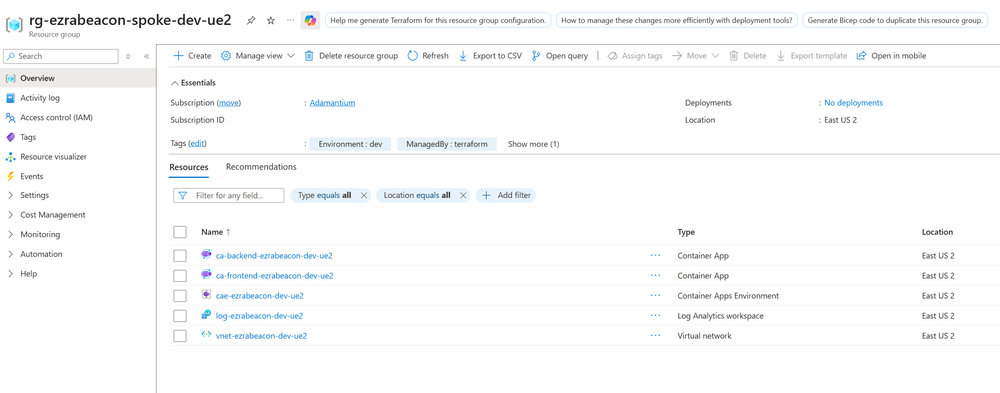

# Ezra Beacon - Task Management PWA

[](https://github.com/DustyAyres/ezra-beacon/actions/workflows/ci.yml)
[](https://github.com/DustyAyres/ezra-beacon/actions/workflows/cd.yml)
[](https://github.com/DustyAyres/ezra-beacon/actions/workflows/pr-validation.yml)

## Table of Contents

- [GitHub Configuration](#github-configuration)
  - [Repository Variables](#repository-variables)
  - [Repository Secrets](#repository-secrets)
- [Technology Stack](#technology-stack)
- [Prerequisites](#prerequisites)
- [Azure Setup Guide](#azure-setup-guide)
  - [1. Azure AD App Registration (MSAL Authentication)](#1-azure-ad-app-registration-msal-authentication)
  - [2. Service Principal for Terraform/GitHub Actions](#2-service-principal-for-terraformgithub-actions)
  - [3. Azure Hosting Prerequisites](#3-azure-hosting-prerequisites)
  - [4. Deployed Architecture](#4-deployed-architecture)
- [Local Development](#local-development)
  - [Method 1: Docker Development (Simplest)](#method-1-docker-development-simplest)
  - [Method 2: Backend Development](#method-2-backend-development)
  - [Method 3: Frontend Development](#method-3-frontend-development)
  - [Method 4: Full Azure AD Authentication (Production-like)](#method-4-full-azure-ad-authentication-production-like)
- [Running Tests](#running-tests)
- [Project Structure](#project-structure)
- [License](#license)

## GitHub Configuration

### Repository Variables
Configure in: Settings > Secrets and variables > Actions > Variables

| Variable | Description | Example |
|----------|-------------|---------|
| `REACT_APP_API_URL` | Backend API URL | `/api` (for relative URL) |
| `REACT_APP_AZURE_REDIRECT_URI` | Frontend URL for Azure AD | `https://ca-frontend-ezrabeacon-dev-ue2.azurecontainerapps.io` |
| `REACT_APP_BYPASS_AUTH` | Enable dev auth bypass | `false` for production, `true` for dev |
| `REACT_APP_AZURE_CLIENT_ID` | Azure AD App Client ID | `xxxxxxxx-xxxx-xxxx-xxxx-xxxxxxxxxxxx` |
| `REACT_APP_AZURE_TENANT_ID` | Azure AD Tenant ID | `xxxxxxxx-xxxx-xxxx-xxxx-xxxxxxxxxxxx` |

### Repository Secrets
Configure in: Settings > Secrets and variables > Actions > Secrets

| Secret | Description | Example |
|--------|-------------|---------|
| `AZURE_CLIENT_ID` | Service Principal Client ID for GitHub Actions | `xxxxxxxx-xxxx-xxxx-xxxx-xxxxxxxxxxxx` |
| `AZURE_TENANT_ID` | Azure AD Tenant ID | `xxxxxxxx-xxxx-xxxx-xxxx-xxxxxxxxxxxx` |
| `AZURE_SUBSCRIPTION_ID` | Azure Subscription ID | `xxxxxxxx-xxxx-xxxx-xxxx-xxxxxxxxxxxx` |
| `AZURE_AD_DOMAIN` | Azure AD Domain | `yourdomain.onmicrosoft.com` |
| `ACR_NAME` | Azure Container Registry name | `acrezrabeacondev` |
| `ACR_LOGIN_SERVER` | ACR login server URL | `acrezrabeacondev.azurecr.io` |
| `ACR_USERNAME` | ACR username | `acrezrabeacondev` |
| `ACR_PASSWORD` | ACR password | `<from Azure Portal>` |
| `TF_STATE_STORAGE_ACCOUNT` | Terraform state storage account | `saezrabeacontfstatedev` |
| `TF_STATE_CONTAINER` | Terraform state container name | `tfstate` |
| `TF_STATE_RESOURCE_GROUP` | Terraform state resource group | `rg-ezrabeacon-tfstate-dev` |
| `REACT_APP_AZURE_CLIENT_ID` | Azure AD App Client ID (if using secrets) | `xxxxxxxx-xxxx-xxxx-xxxx-xxxxxxxxxxxx` |

## Technology Stack

- **Frontend**: React 18, TypeScript
- **Backend**: .NET 8.0 Web API, Entity Framework Core
- **Database**: SQLite (local/dev), ephemeral storage in Azure Container Apps
- **Authentication**: Microsoft Entra ID (Azure AD) with MSAL
- **Containerization**: Docker, Docker Compose
- **Infrastructure**: Azure Container Apps, Azure Container Registry, Terraform
- **CI/CD**: GitHub Actions
- **Testing**: Jest (Frontend), xUnit (.NET)

## Prerequisites

### Minimum Requirements (Docker Development)
- Docker Desktop
- Git

### Full Development Requirements
- Docker Desktop
- Node.js 20+
- .NET SDK 8.0
- Visual Studio 2022 or VS Code
- Azure CLI (for deployment)
- Terraform (for infrastructure)

### Azure Requirements
- Azure Subscription
- Azure AD App Registration
- Service Principal for GitHub Actions

## Azure Setup Guide

### 1. Azure AD App Registration (MSAL Authentication)

Configure Azure AD for user authentication:

**Steps:**
1. Navigate to Azure Portal → Azure Active Directory → App registrations

2. Create new registration with name like "Ezra Beacon"
3. Configure redirect URIs for your environments:
   - Local: `http://localhost:3000`
   - Production: `https://your-frontend-url.azurecontainerapps.io`

4. Expose an API scope: `api://<client-id>/access_as_user`


5. Configure authentication settings for SPA

### 2. Service Principal for Terraform/GitHub Actions

Set up OIDC authentication for GitHub Actions:


**Steps:**
1. Create a new App Registration for Terraform/GitHub Actions

2. Add Federated Credentials:
   - Organization: `YourGitHubOrg`
   - Repository: `ezra-beacon`
   - Entity type: `Environment`
   - Environment: `dev` (repeat for each environment)

3. Grant RBAC permissions:
   - **Option 1 (Recommended)**: Contributor role at Resource Group level
   - **Option 2**: Contributor role at Subscription level
4. Note the Client ID, Tenant ID for GitHub Secrets

### 3. Azure Hosting Prerequisites

Before deploying to Azure:



**Required Steps:**
1. **Enable Resource Provider**:
   ```bash
   az provider register --namespace Microsoft.App
   ```



2. **Create Hub Resource Group** (following hub-spoke pattern):
   ```bash
   az group create --name rg-ezrabeacon-hub-dev --location eastus2
   ```

3. **Create Azure Container Registry** (or include in Terraform):
   ```bash
   az acr create --name acrezrabeacondev --resource-group rg-ezrabeacon-hub-dev --sku Basic
   ```

4. **Create Terraform State Storage**:
   ```bash
   # Create resource group for Terraform state
   az group create --name rg-ezrabeacon-tfstate-dev --location eastus2
   
   # Create storage account
   az storage account create --name saezrabeacontfstatedev \
     --resource-group rg-ezrabeacon-tfstate-dev \
     --sku Standard_LRS
   
   # Create blob container
   az storage container create --name tfstate \
     --account-name saezrabeacontfstatedev
   ```

5. **Configure GitHub Secrets** (see table above)

6. **Run CD Pipeline** to deploy infrastructure

### 4. Deployed Architecture

The deployed infrastructure follows hub-spoke architecture:



**Resources Created:**
- **Container Apps**: Separate frontend and backend apps
- **Container Apps Environment (CAE)**: Shared hosting environment
- **Log Analytics Workspace (LAW)**: Billing isolation and monitoring
- **Virtual Network**: Network isolation and future Azure SQL integration
- **Resource Groups**: Hub (shared resources) and Spoke (environment-specific)

## Local Development

### Method 1: Docker Development (Simplest)

This is the easiest way to get started. No Azure AD setup required.

1. **Clone the repository**
   ```bash
   git clone <repository-url>
   cd ezra-beacon
   ```

2. **Create environment file**
   ```bash
   cp env.example .env
   ```
   
   The default `.env` file has `BYPASS_AUTH=true`, which bypasses authentication.

3. **Run with Docker Compose**
   ```bash
   docker-compose up --build
   ```

4. **Access the application**
   - Frontend: http://localhost:3000
   - Backend API: http://localhost:5000
   - Swagger UI: http://localhost:5000/swagger (dev mode only)

That's it! You'll see a "DEV MODE" badge in the UI indicating authentication is bypassed.

### Method 2: Backend Development

For backend development with full debugging capabilities:

1. **Start the frontend in Docker**
   ```bash
   docker-compose up -d frontend
   ```

2. **Open the backend solution in Visual Studio**
   ```bash
   cd backend
   start EzraBeacon.sln
   ```

3. **Set startup project**
   - Right-click `EzraBeacon.Api` → Set as Startup Project

4. **Configure environment variables**
   - Right-click `EzraBeacon.Api` → Properties → Debug
   - Add environment variables:
     ```
     Development__BypassAuthentication=true
     FRONTEND_URL=http://localhost:3000
     ```

5. **Run the project** (F5)
   - Backend will run on http://localhost:5000
   - Frontend (from Docker) on http://localhost:3000

### Method 3: Frontend Development

For frontend development with hot reload:

1. **Start the backend in Docker**
   ```bash
   docker-compose up -d backend
   ```

2. **Install frontend dependencies**
   ```bash
   cd frontend
   npm install
   ```

3. **Create frontend environment file**
   ```bash
   cp env.example .env
   ```
   
   Ensure it contains:
   ```
   REACT_APP_API_URL=http://localhost:5000/api
   REACT_APP_BYPASS_AUTH=true
   ```

4. **Start the frontend**
   ```bash
   npm start
   ```

5. **Access the application**
   - Frontend: http://localhost:3000 (with hot reload)
   - Backend API: http://localhost:5000

### Method 4: Full Azure AD Authentication (Production-like)

For testing with real Azure AD authentication:

1. **Configure Azure AD**
   - Create an App Registration in Azure Portal
   - Configure redirect URI: `http://localhost:3000`
   - Expose an API scope: `api://<client-id>/access_as_user`
   - Note the Client ID, Tenant ID, and Domain

2. **Update environment file**
   ```bash
   BYPASS_AUTH=false
   AZURE_CLIENT_ID=your-client-id
   AZURE_TENANT_ID=your-tenant-id
   AZURE_DOMAIN=your-domain.onmicrosoft.com
   AZURE_REDIRECT_URI=http://localhost:3000
   ```

3. **Run with Docker Compose**
   ```bash
   docker-compose up --build
   ```

## Running Tests

### Backend Tests
```bash
cd backend
dotnet test
```

### Frontend Tests
```bash
cd frontend
npm test
```

### Frontend Tests with Coverage
```bash
cd frontend
npm test -- --coverage --watchAll=false
```

## Project Structure

```
ezra-beacon/
├── .github/                    # GitHub Actions workflows
│   └── workflows/
│       ├── ci.yml             # Continuous Integration pipeline
│       ├── cd.yml             # Continuous Deployment pipeline
│       └── pr-validation.yml  # Pull Request validation
├── backend/                    # .NET Core Web API
│   ├── EzraBeacon.Api/        # Web API project
│   │   ├── Controllers/       # API endpoints
│   │   ├── DTOs/             # Data transfer objects
│   │   ├── Authentication/   # Auth handlers
│   │   └── Program.cs        # Application entry point
│   ├── EzraBeacon.Core/       # Domain models and interfaces
│   │   └── Entities/         # Task, Category, User models
│   ├── EzraBeacon.Infrastructure/  # Data access layer
│   │   ├── Data/             # DbContext and configurations
│   ├── EzraBeacon.Tests/      # Unit and integration tests
│   └── backend.Dockerfile     # Backend container definition
├── frontend/                   # React PWA application
│   ├── public/                # Static assets
│   │   └── assets/           # Fonts, icons, manifests
│   ├── src/
│   │   ├── components/       # Shared UI components
│   │   ├── features/         # Feature-based modules
│   │   │   ├── auth/        # Authentication
│   │   │   ├── categories/  # Category management
│   │   │   └── tasks/       # Task management
│   │   ├── lib/             # API client and utilities
│   │   ├── types/           # TypeScript type definitions
│   │   └── App.tsx          # Root component
│   └── frontend.Dockerfile    # Frontend container definition
├── scripts/                    # Deployment and utility scripts
│   └── deploy-to-acr.sh    # Bash Script to Push Docker Image(s) to ACR
├── terraform/                  # Infrastructure as Code
│   ├── main.tf                # Azure resources definition
│   ├── variables.tf           # Terraform variables
│   ├── outputs.tf             # Output values
│   └── environments/          # Environment-specific configs
│       └── dev.tfvars        # Development environment Variables
├── docker-compose.yml          # Local development orchestration
├── env.example                 # Example environment variables
└── README.md                   # This file
```

## License

The MIT License (MIT)

Permission is hereby granted, free of charge, to any person obtaining a copy of this software and associated documentation files (the "Software"), to deal in the Software without restriction, including without limitation the rights to use, copy, modify, merge, publish, distribute, sublicense, and/or sell copies of the Software, and to permit persons to whom the Software is furnished to do so, subject to the following conditions:

The above copyright notice and this permission notice shall be included in all copies or substantial portions of the Software.

THE SOFTWARE IS PROVIDED "AS IS", WITHOUT WARRANTY OF ANY KIND, EXPRESS OR IMPLIED, INCLUDING BUT NOT LIMITED TO THE WARRANTIES OF MERCHANTABILITY, FITNESS FOR A PARTICULAR PURPOSE AND NONINFRINGEMENT. IN NO EVENT SHALL THE AUTHORS OR COPYRIGHT HOLDERS BE LIABLE FOR ANY CLAIM, DAMAGES OR OTHER LIABILITY, WHETHER IN AN ACTION OF CONTRACT, TORT OR OTHERWISE, ARISING FROM, OUT OF OR IN CONNECTION WITH THE SOFTWARE OR THE USE OR OTHER DEALINGS IN THE SOFTWARE.